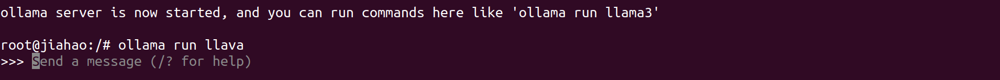

# Multimodel RAG with Ollama:llava and LlamaIndex on Jetson

Here I use reComputer J4012 powered by NVIDIA [Jetson Orin NX 16GB](https://www.seeedstudio.com/reComputer-J4012-p-5586.html).
## Pareper environment

```
# install the container tools
git clone https://github.com/dusty-nv/jetson-containers
bash jetson-containers/install.sh
```

```
# Ollam:llava will be our multimodel model
jetson-containers run --name ollama $(autotag ollama)
ollama run llava
```
The result is as follows:


Open a new terminal and run:
```
cd jetson-containers
cd data
git clone https://github.com/ollama/multimodal-rag.git
cd ..
jetson-containers run $(autotag l4t-pytorch)
cd data/Multimodal-RAG-on-Jetson
```

## Run Multimodal-RAG-on-Jetson
```
bash run.sh
```
